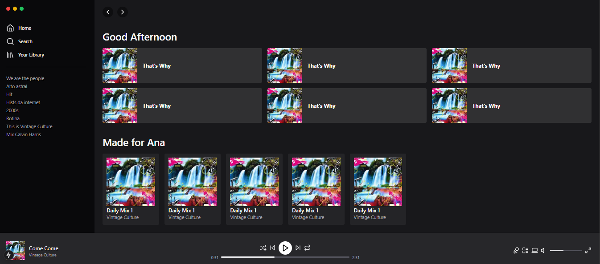

# Spotify Clone

Este é um clone básico da interface do Spotify, criado usando React, Next.js e Tailwind CSS. O objetivo do projeto é replicar a interface de um serviço de streaming de música, com navegação, controle de reprodução e visualização de álbuns.

<div>
    
</div>

## 🔥 Introdução

Este projeto tem como objetivo fornecer uma interface de usuário (UI) semelhante ao Spotify, onde os usuários podem navegar entre a biblioteca, buscar músicas e controlar a reprodução de álbuns e listas de reprodução.

### ⚙️ Pré-requisitos

Antes de começar, você precisará ter o Node.js instalado na sua máquina. Se você ainda não tem o Node.js, baixe e instale a versão mais recente a partir de [aqui](https://nodejs.org/).

Além disso, você precisará ter o `npm` (Node Package Manager) ou `yarn` instalados.


### 🔨 Guia de instalação

1. Clone este repositório:
```
https://github.com/ribbeiroana/tailwind_spotify.git
```

2. Navegue até o diretório do projeto:
  ```
cd spotify-clone
``` 

3. Instale as dependências:
  ```
npm install
```

4. Execute o projeto:
  ```
npm run dev
```

Agora, você deve ser capaz de acessar o projeto na sua máquina local.

## 📦 Tecnologias usadas:

Este projeto foi criado utilizando as seguintes tecnologias:

* 
* 
* 
* 


Este é apenas um clone da interface do Spotify, sem integração real com um backend. Funcionalidades como login de usuário, integração com uma API de música e playlist personalizada podem ser adicionadas no futuro.
